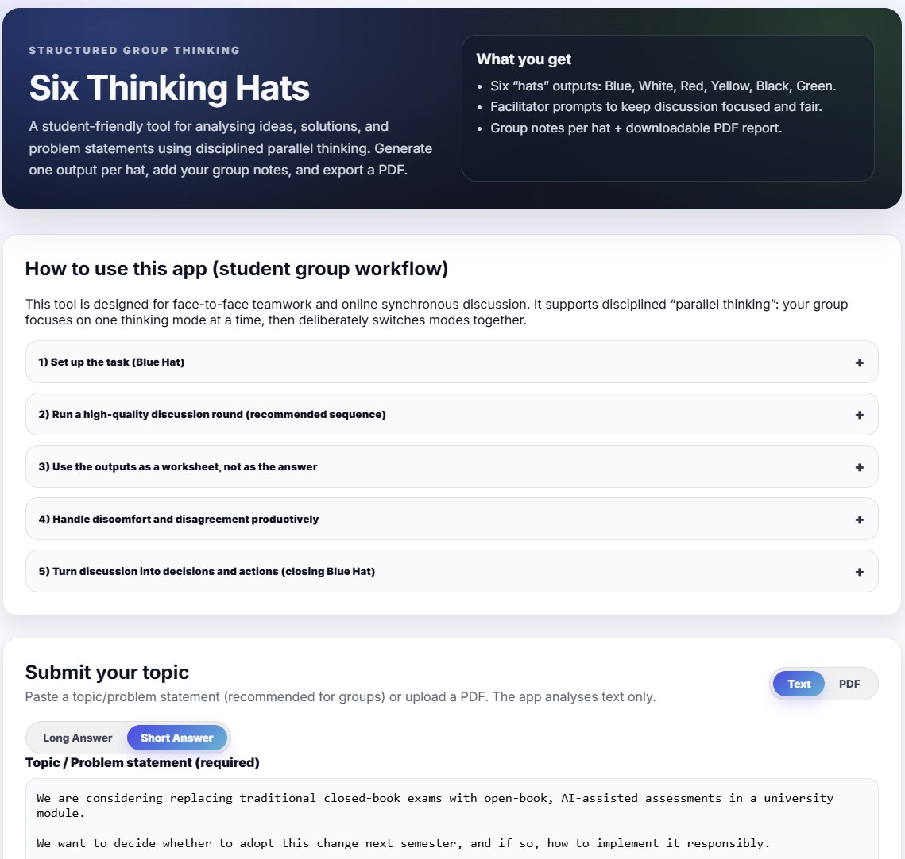
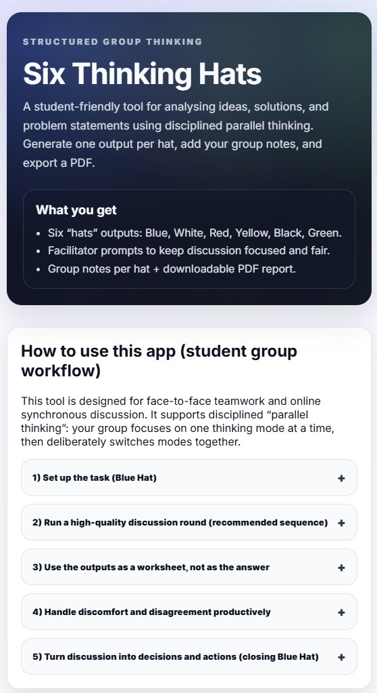

# Six Thinking Hats — Student Group Analysis App

A lightweight, single-service web app for analysing an idea, solution, or problem statement using Edward de Bono’s **Six Thinking Hats** method.

<table style="border:2px solid red; border-collapse:collapse;">
  <tr>
    <td style="border:2px solid red; text-align:center; vertical-align:middle;"></td>
    <td style="border:2px solid red; text-align:center; vertical-align:middle;"></td>
  
  </tr>
</table> 

## What this app does

- Accepts either:
  - **Text input** (recommended for student groups: a guided template), or
  - **PDF upload** (text extraction only; scanned images are not analysed).
- Sends the extracted text to an LLM endpoint (default: **Gemma-SEA-LION-v4-27B-IT**) for six independent “hat” outputs:
  - **Blue**: process, agenda, priorities
  - **White**: facts, information, unknowns
  - **Red**: feelings, intuitions, stakeholder emotions
  - **Black**: risks, constraints, failure modes
  - **Yellow**: benefits, value, success conditions
  - **Green**: alternatives, creativity, experiments
- Provides a **group-friendly UI**:
  - Hat-specific facilitator prompts
  - Per-hat **group notes** (client-side; not stored)
  - Copy-to-clipboard for the active hat output
  - **Downloadable PDF report** (includes group notes if you added them)

## When to use it

Use this app when your group needs to move beyond unstructured debate and produce a disciplined, complete view of:

- What is true / verified vs assumed (White)
- What people feel and fear (Red)
- Where the downsides and constraints are (Black)
- Where the upside and value are (Yellow)
- What options or improvements exist (Green)
- How to manage the thinking and decide next steps (Blue)

## Recommended student group workflow

### Group size and roles
- Best with **3–6 students**.
- Suggested roles:
  - **Facilitator (Blue Hat)**: keeps time, enforces “one hat at a time”, prevents cross-talk.
  - **Recorder**: types group notes into the app (or shares screen while typing).
  - **Evidence lead (White Hat)**: checks sources quickly, lists what must be verified.

You can rotate roles between sessions.

### A high-quality standard sequence (40–60 minutes)
A common decision-making sequence is:

**Blue → White → Red → Yellow → Black → Green → Blue**

Suggested timing:
- **Blue (2–3 min):** confirm the question, scope, time-box, and output.
- **White (8–12 min):** agree on what is known vs unknown; list verification tasks.
- **Red (1–2 min):** quick gut reactions; no debate.
- **Yellow (6–8 min):** benefits and success conditions.
- **Black (8–12 min):** risks, constraints, failure modes.
- **Green (8–12 min):** alternatives, improvements, experiments.
- **Blue (4–6 min):** synthesize and commit to next actions.

### How to use the app during discussion
1. **Write the topic** in the text template (keep it short and specific).
2. Add:
   - **Decision to make** (what you will decide at the end)
   - **Stakeholders** (who is affected)
   - **Constraints** (non-negotiables)
   - Optional **context** (background)
3. Click **Analyze**.
4. Start with **Blue Hat** to align on the question and agenda.
5. For each hat:
   - Read the LLM output aloud (or silently),
   - Discuss only through that hat,
   - Write your own conclusions in the **Group notes** panel.
6. Download the report when finished.

### Short Answer vs Long Answer
- **Long Answer** (default): richer prompts and more detailed outputs; best for deep learning.
- **Short Answer**: more concise; best for time-boxed tutorials or quick iterations.

## What makes Six Thinking Hats useful for groups

Many group discussions mix facts, emotion, critique, and creativity at the same time. The result is often:

- “Argument ping-pong” (people talking past each other)
- Over-dominance of critical judgement (Black Hat) too early
- Under-developed creativity (Green Hat)
- Decisions made without a shared information base (White Hat)

Six Thinking Hats reduces this by forcing **parallel thinking**: everyone uses the same mode at the same time.

## Privacy and data handling

- The app **does not store** your input text or uploaded PDFs.
- Your text is sent to the configured LLM endpoint for analysis.
- Group notes are stored in **your browser session** and are only sent to the server when you export a PDF.

```

## References (method background)

- Edward de Bono / De Bono Group — Six Thinking Hats


